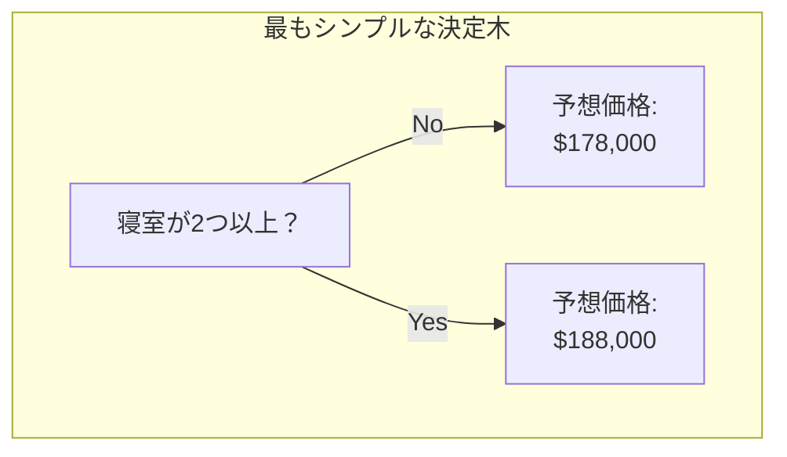
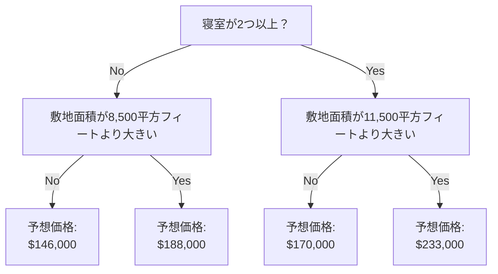

[Kaggle入門1 機械学習Intro 1.モデルの仕組み](https://zenn.dev/rg687076/articles/0386269e85da8f)
[Kaggle入門1 機械学習Intro 2.基本的なデータ探索](https://zenn.dev/rg687076/articles/76fcc58ec39848)
[Kaggle入門1 機械学習Intro 3.初めての機械学習モデル](https://zenn.dev/rg687076/articles/6ad3407fece568)
[Kaggle入門1 機械学習Intro 4.モデルの検証](https://zenn.dev/rg687076/articles/290ea78580f2b2)
[Kaggle入門1 機械学習Intro 5.アンダーフィッティングとオーバーフィッティング](https://zenn.dev/rg687076/articles/eabd73cd0b6219)
[Kaggle入門1 機械学習Intro 6. ランダムフォレスト](https://zenn.dev/rg687076/articles/30b3d16e6086c9)
[Kaggle入門1 機械学習Intro 7. 機械学習コンペティション 最終回](https://zenn.dev/rg687076/articles/0f5cb99d865d00)

→[Kaggle入門2 Python Pandasライブラリの使い方 1.生成/読込/書込](https://zenn.dev/rg687076/articles/0467242dc7b343)

最近よく聞く生成AI、それを作る側の人になりたい。
「Kaggle」ってサイトがそれを可能にしてくれるみたいなんだけど、まさにAIエンジニアの登竜門という雰囲気あるんだけど、このサイト全編英語でなんじゃこりゃーってなる。
なので翻訳しながら進めてみました。英語なのでニの足を踏んでる人向けに役に立つのではないかと。

# Abstract
Kaggle「Intro to Machine Learningの[How Models Work](https://www.kaggle.com/code/dansbecker/how-models-work)」の翻訳と実行方法の解説

## 1. モデルの仕組み
### 序論 (Introduction)
まずは、機械学習モデルがどのように機能し、どのように利用されているかについて概要を説明します。統計モデリングや機械学習の経験がある方には、基本的な内容に感じられるかもしれません。ご安心ください、すぐに強力なモデルの構築へと進んでいきます。

このコースでは、以下のシナリオに沿ってモデルを構築していきます。
承知いたしました。自然な日本語に翻訳します。

### シナリオ
あなたの従兄弟（いとこ）は、不動産投機で数億円を稼いでいます。あなたはデータサイエンスに興味があるため、彼はあなたにビジネスパートナーになることを提案しました。彼が資金を提供し、あなたは様々な住宅の価値を予測するモデルを提供します。

あなたは従兄弟に、これまでの不動産価値をどのように予測してきたのか尋ねましたが、彼は「直感だ」と答えます。しかし、さらに詳しく聞くと、彼は過去に見た住宅から価格パターンを特定し、そのパターンを使って検討中の新しい住宅の予測を立てていることが分かりました。

機械学習も同様に機能します。

私たちはまず、「決定木 (Decision Tree)」と呼ばれるモデルから始めます。より正確な予測を行う洗練されたモデルもありますが、決定木は理解しやすく、データサイエンスにおける最高のモデルの一部を構成する基本的な構成要素となっているからです。

### 最もシンプルな決定木
分かりやすくするため、まずは最もシンプルな決定木から始めます。

これは、住宅をたった2つのカテゴリに分類するだけです。検討中のどの住宅についても、予測される価格は、同じカテゴリに属する住宅の過去の平均価格となります。

私たちは、データを使用して、住宅をどのように2つのグループに分割するかを決定し、次に各グループの予測価格を決定します。データからパターンを捉えるこの手順は、モデルの「フィッティング (fitting)」または「トレーニング (training)」と呼ばれます。モデルをフィッティングするために使われるデータは、「トレーニングデータ (training data)」と呼ばれます。

モデルがどのようにフィッティングされるか（例：データをどのように分割するか）の詳細は複雑であるため、後の章で解説します。モデルがフィッティングされた後、それを新しいデータに適用することで、追加の住宅の価格を予測することができます。

### 決定木の改良 (Improving the Decision Tree)
以下の2つの決定木のうち、不動産のトレーニングデータにフィッティングした結果としてより適切なのはどちらでしょうか？

おそらく、左側の決定木（決定木1）の方が理にかなっているでしょう。なぜなら、寝室の数が多い住宅ほど、少ない住宅よりも高値で売れるという現実を捉えているからです。このモデルの最大の欠点は、浴室の数、敷地の広さ、場所など、住宅価格に影響を与えるほとんどの要因を捉えていないことです。

より多くの要因を捉えるには、より多くの「分割 (splits)」を持つツリーを使用します。これらは「より深い (deeper)」ツリーと呼ばれます。各住宅の敷地の総面積も考慮に入れた決定木は、次のようになるかもしれません。

あなたは、その住宅の特性に対応するパスを常に選択しながら決定木をたどることで、どの住宅の価格でも予測することができます。住宅の予測価格は、ツリーの最下部にあります。予測を行うこの最下部の点を、「葉 (leaf)」と呼びます。

分割の基準や葉における値はデータによって決定されます。さあ、いよいよあなたが取り組むことになるデータを確認する時が来ました。

次の章[(2.基本的なデータ探索)](https://zenn.dev/rg687076/articles/76fcc58ec39848)へ
