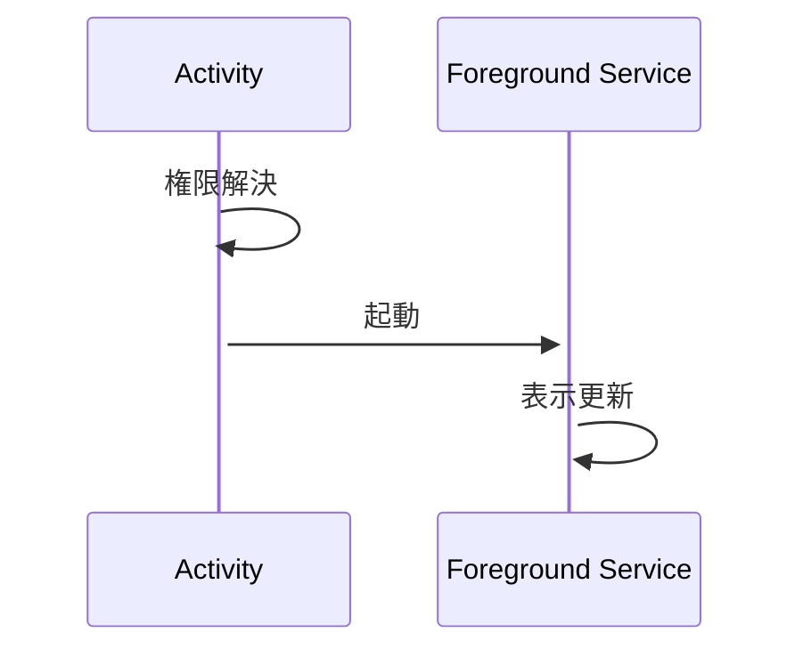

Android Homeを自由に動き回るアイコンを作ってみたかった。

# Abstract
- AndroidアプリでHome画面をアイコンが自由に動き回るアプリのサンプル。

# ソース一式
https://github.com/aaaa1597/AndKot-FloatingIconSample

# 概要
「そういえば、Home画面をアイコンが自由に動き回るアプリって見たことないな」って純粋な興味から作ってみた。
:::message
ただし、SYSTEM_ALERT_WINDOW権限 を使ったアプリはPlay Store に公開するのは難しいらしい。
:::

# 要点説明
具体的な実装は上記githubを見ればわかるとして、要点は以下の通り。

## 1. Foreground Serviceを使う
動きとしては、Activityで権限解決 → Foreground Serviceで表示・更新となる。



## 2. 権限回り
### 2.1. AndroidManifest.xml
AndroidManifest.xmlで、下記権限を定義する。

```shell: AndroidManifest.xml
    <uses-permission android:name="android.permission.SYSTEM_ALERT_WINDOW" />
    <uses-permission android:name="android.permission.FOREGROUND_SERVICE" />
    <uses-permission android:name="android.permission.FOREGROUND_SERVICE_SPECIAL_USE" />
    <uses-permission android:name="android.permission.POST_NOTIFICATIONS" />
```

### 2.2. MainActivity.ktで、権限承認の実装。
一度に全部の権限を承認することはできない。
通常のパーミッション(通知)と、オーバーレイ設定を別々にユーザーに承認を求める必要がある。これは地味にめんどい。
```kotlin: MainActivity.kt
    /* オーバーレイ設定画面から戻ってきたときの判定用ランチャー */
    private val overlayPermissionLauncher = registerForActivityResult(ActivityResultContracts.StartActivityForResult()) {
        /* 設定画面から戻った時点で、両方の権限が揃っているか最終確認 */
        if (checkAllPermissionsGranted()) {
            startOverlayService()
        }
        else {
            /* オーバーレイ権限をONにしてもらえなかったらアラートを出して終了 */
            PermissionDialogFragment.show(this, isOverlayError = true)
        }
    }

    /* 通常のパーミッション（通知など）を要求するランチャー */
    private val permissionLauncher = registerForActivityResult(ActivityResultContracts.RequestMultiplePermissions()) {
        isGranted: Map<String, Boolean> ->
            /* 権限チェック */
            if (isGranted.isNotEmpty() && isGranted.all { it.value }) {
                /* 通知権限がOKなら、次はオーバーレイ権限をチェック */
                checkOverlayPermission()
            } else {
                /* 通知権限が拒否されたらアラートダイアログ→Shutdown */
                PermissionDialogFragment.show(this, isOverlayError = false)
            }
    }
```

### 2.3. Foreground Service起動 → View表示・更新
MainActivity.ktでは、View表示は行わない。
Foreground Service起動を起動後、Foreground ServiceでViewを表示・更新する。

```kotlin: MainActivity.kt
    /* 安全にフォアグラウンドサービスを起動し、Activityを終了する共通関数 */
    private fun startOverlayService() {
        val intent = Intent(this, OverlayService::class.java)
        startForegroundService(intent)
        finish() /* サービスが起動したら、このActivityは閉じる */
    }
```

```kotlin: OverlayService.kt
        /* 表示するViewの生成 (今回は簡単なレイアウトファイルをインフレート) */
        overlayView = LayoutInflater.from(this).inflate(R.layout.overlay_layout, null)

        layoutParams = WindowManager.LayoutParams(
            WindowManager.LayoutParams.WRAP_CONTENT,
            WindowManager.LayoutParams.WRAP_CONTENT,
            WindowManager.LayoutParams.TYPE_APPLICATION_OVERLAY,
            WindowManager.LayoutParams.FLAG_NOT_FOCUSABLE,   /* タッチイベントを後ろに透過させる場合はこれ */
            PixelFormat.TRANSLUCENT
        ).apply {
            gravity = Gravity.TOP or Gravity.START  /* 画面上部中央に配置 */
            x = 100
            y = 200
        }

        /* 画面にビューを追加 */
        windowManager.addView(overlayView, layoutParams)
        startMoving()
    }
```
出来た！
期待通り、home画面でアイコンが移動してる。


お役に立てれば。
