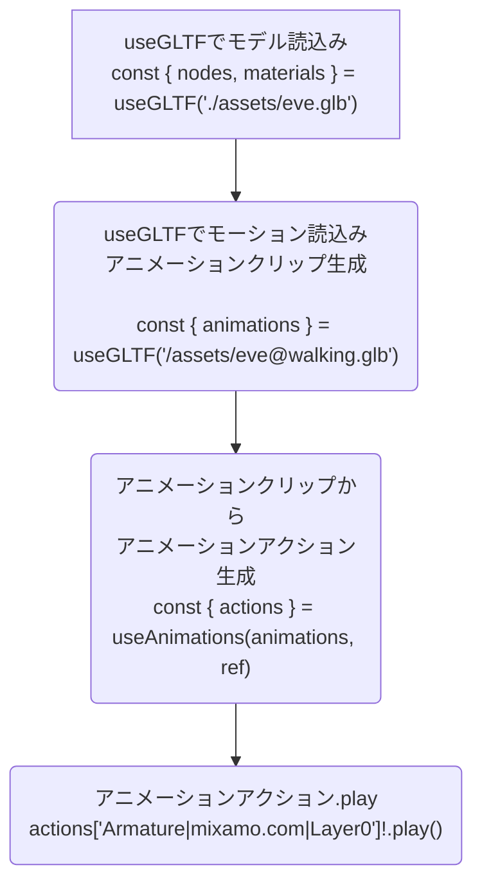

# Abstract
今回の参考は[ここ(Animation from Separate File)](https://sbcode.net/react-three-fiber/animation-separate-file/)。このソースをTypeScriptで実装しなおす。

## ポイント
- *.glbの3Dモデル読込みと表示
- *.glbのアニメーションデータ読込みと実行

# 結論
今回の成果物はココ↓
https://github.com/aaaa1597/react-r3f-advanced004

# 前提
- React+Typescriptの開発環境は構築済 [[環境構築]WindowsにVSCode+React+TypeScriptの開発環境を構築してみた。](https://zenn.dev/rg687076/articles/491d01e35cbce7)
- このスケルトンコードから始める。[react-r3f-base-onebox](https://github.com/aaaa1597/react-r3f-base-onebox)
 
# 手順
## 1.プロジェクト生成 -> VSCodeで開く
めんどいから、このスケルトンコードから始める。[react-r3f-base-onebox](https://github.com/aaaa1597/react-r3f-base-onebox)
で、下記コマンドでフォルダ名とか整備する。
```shell:フォルダリネームとか
$ D:
$ cd .\Products\React.js\            # ご自身の適当なフォルダで。
$ rd /q /s D:\Products\React.js\react-r3f-advanced004
$ git clone https://github.com/aaaa1597/react-r3f-base-onebox.git
$ rd /q /s react-r3f-base-onebox/.git
$ ren react-r3f-base-onebox react-r3f-advanced004
$ cd react-r3f-advanced004
```

# 準備
```shell:コマンドプロンプト
$ npm install --save three
$ npm install --save @types/three
$ npm install --save @react-three/fiber
$ npm install --save @react-three/drei
```
# 準備2
- [ここ](https://github.com/aaaa1597/react-r3f-advanced005/tree/main/public)からDLしたモデル一式をプロジェクトの"react-r3f-advanced004/public/assets"配下にコピー。

# .eslintrc.jsを修正
エラーになるので、ignoreに追加
```diff ts:.eslintrc.js
     "rules": {
-        "react/no-unknown-property": ['error', { ignore: ['css', "args", 'wireframe', 'rotation-x', 'rotation'] }],
+        "react/no-unknown-property": ['error', { ignore: ['css', "args", 'wireframe', 'rotation-x', 'rotation', 'dispose', 'object', 'castShadow', 'frustumCulled', 'geometry', 'material', 'skeleton'] }],
     }
```

# App.tsx
まず全体。
```diff ts:App.tsx
-import React, {useRef} from 'react';
+import React, {useRef, Suspense, useEffect} from 'react';
import './App.css';
import * as THREE from 'three'
-import { Canvas, useFrame, MeshProps  } from '@react-three/fiber'
-import { OrbitControls, Environment } from '@react-three/drei'
+import { Canvas, useFrame, useThree } from '@react-three/fiber'
+import { Stats, OrbitControls, Environment, useGLTF, useAnimations, PerspectiveCamera } from '@react-three/drei'

-const Box = (props: MeshProps) => {
+const Eve = () => {
  const ref = useRef<THREE.Group>(null!)
+ const { nodes, materials } = useGLTF('./assets/eve.glb')
+ const { animations } = useGLTF('/assets/eve@walking.glb')
+ const { actions } = useAnimations(animations, ref)
+ const { camera } = useThree()

  useFrame(() => {
-   if( !ref.current) return
-   ref.current.rotation.x += 1 * delta
-   ref.current.rotation.y += 0.5 * delta
    camera.lookAt(0, 1, 0)
  })

+  useEffect(() => {
+    actions['Armature|mixamo.com|Layer0']!.play()
+  }, [actions])
+
  return(
-   <mesh {...props} ref={ref}>
-     <boxGeometry />
-     <meshNormalMaterial />
-   </mesh>  
+   <group ref={ref} dispose={null}>
+     <group name="Scene">
+       <group name="Armature" rotation={[Math.PI / 2, 0, 0]} scale={0.01}>
+         <primitive object={nodes.mixamorigHips} />
+         <skinnedMesh castShadow name="Mesh" frustumCulled={false}
+                     geometry={(nodes.Mesh as THREE.SkinnedMesh).geometry} material={materials.SpacePirate_M}
+                     skeleton={(nodes.Mesh as THREE.SkinnedMesh).skeleton}/>
+       </group>
+     </group>
+   </group>
  )
}

+const Loader = () => {
+  return <div className="loader"></div>
+}

const App = () => {
  return (
    <div style={{ width: "100vw", height: "75vh" }}>
+     <Suspense fallback={<Loader />}>
-       <Canvas camera={{ position: [3, 1, 2] }}>
+       <Canvas>
+         <PerspectiveCamera makeDefault position={[2, 1.5, 2]} />
          <Environment preset="forest" background />
+         <Eve />
          <OrbitControls />
          <axesHelper args={[5]} />
          <gridHelper />
          <Stats />
        </Canvas>
+     </Suspense>
    </div>
  );
}

export default App;
```
で、実行。


出来た!!


# まとめ
## 1.アニメーションの使い方


## 2.アニメーションアクションで設定する文字列の調べ方
```ts:App.tsx
    actions['Armature|mixamo.com|Layer0']!.play()
```
↑ここで設定する文字列('Armature|mixamo.com|Layer0')は、Blenderで開いて確認する。


---
[React+TypeScript+R3Fのtutorial応用編3(glTFで3Dアニメーション(単一モデル))](https://zenn.dev/rg687076/articles/7820cee0480eeb)

---
[React+TypeScript+R3Fのtutorial応用編5(glTFで3Dアニメーション(モーション切替え))](https://zenn.dev/rg687076/articles/5c84eaf7d175b4)