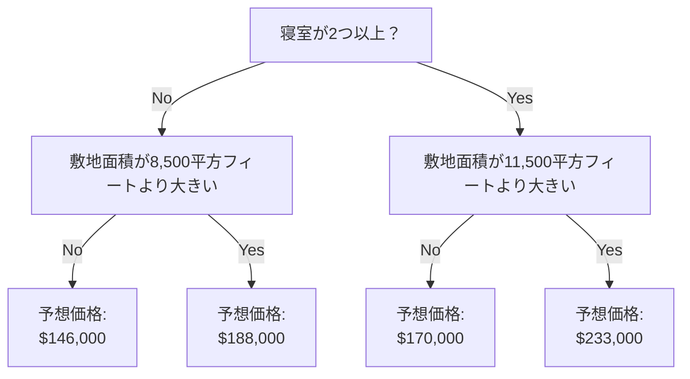

[Kaggle入門1 機械学習Intro 1.モデルの仕組み](https://zenn.dev/rg687076/articles/0386269e85da8f)
[Kaggle入門1 機械学習Intro 2.基本的なデータ探索](https://zenn.dev/rg687076/articles/76fcc58ec39848)
[Kaggle入門1 機械学習Intro 3.初めての機械学習モデル](https://zenn.dev/rg687076/articles/6ad3407fece568)
[Kaggle入門1 機械学習Intro 4.モデルの検証](https://zenn.dev/rg687076/articles/290ea78580f2b2)
[Kaggle入門1 機械学習Intro 5.アンダーフィッティングとオーバーフィッティング](https://zenn.dev/rg687076/articles/eabd73cd0b6219)
[Kaggle入門1 機械学習Intro 6. ランダムフォレスト](https://zenn.dev/rg687076/articles/30b3d16e6086c9)
[Kaggle入門1 機械学習Intro 7. 機械学習コンペティション 最終回](https://zenn.dev/rg687076/articles/0f5cb99d865d00)

→[Kaggle入門2 Python Pandasライブラリの使い方 1.生成/読込/書込](https://zenn.dev/rg687076/articles/0467242dc7b343)

Kaggle入門(機械学習Intro 4.モデルの検証)の続きです。

# Abstract
Kaggle「Intro to Machine Learningの[Underfitting and Overfitting](https://www.kaggle.com/code/dansbecker/underfitting-and-overfitting)」の翻訳と実行方法の解説

## 5.アンダーフィッティングとオーバーフィッティング
### 理論編
#### ねらい
このステップの終わりには、「アンダーフィッティング（学習不足）」と「オーバーフィッティング（過学習）」という概念を理解し、これらの考え方を使ってモデルの精度をより高められるようになります。

#### さまざまなモデルを試す

モデルの精度を信頼できる方法で測定できるようになったので、別のモデルを試してどれが最も良い予測をするかを調べることができるようになります。しかし、どんな代替モデルがあるのでしょうか？

scikit-learn のドキュメントを見ると、決定木モデルには非常に多くのオプション（長い間必要としないほどの数）があることが分かります。その中で最も重要なオプションは、木の深さ（depth） を決めるものです。
このコースの最初のレッスンでも説明したように、木の深さとは「予測に至るまでに何回分割を行うか」の指標です。例えば、これは比較的浅い木です：



#### 深さ2の決定木
実際には、トップレベル（すべての家）から葉（leaf）に至るまでに 10回以上の分割 を持つ決定木は珍しくありません。木が深くなるほど、データセットはより細かく分割され、より少ない家が含まれる葉が作られます。

例えば、木が1回だけ分割を行う場合、データは2つのグループになります。
それぞれをもう一度分割すれば4グループ。
さらに分割すれば8グループ。
このように各レベルでグループ数が2倍に増える場合、10レベルまで進むと 2¹⁰ = 1024 の葉ができます。

葉の数が増えるということは、1つの葉に含まれる家の数が少なくなる ということです。
葉に数軒しか家がない場合、その葉の予測はその家たちの実際の値には非常に近くなるものの、新しいデータに対してはかなり信頼性が低くなります（1つの予測が数軒の家だけに基づくため）。

これは **「オーバーフィッティング（過学習）」** と呼ばれる現象で、訓練データにはほぼ完全に一致するのに、検証データや新しいデータに対しては性能が悪くなる状態 を指します。

逆に、木を浅くしすぎると、家を十分に細かく分けられません。

極端な例として、家を2グループや4グループ程度にしか分けないと、それぞれのグループには多種多様な家が含まれたままになります。その結果、訓練データでさえ多くの家に対して予測が大きく外れます（同じ理由で検証データでも悪い結果になります）。
データの重要な区別やパターンをモデルが捉えられず、訓練データでも性能が低い状態を **「アンダーフィッティング（学習不足）」** と呼びます。

私たちが本当に気にするのは 新しいデータに対する精度（検証データで推定）なので、
アンダーフィッティングとオーバーフィッティングの中間の“ちょうど良いポイント” を探す必要があります。

視覚的には、下図の検証データの赤い曲線の最も低い点がそのポイントにあたります。


#### 例（Example）

決定木の深さを制御する方法はいくつかあり、その多くは「木の中のあるルートは深く、別のルートは浅い」というように、ルートごとに異なる深さを持つことを許容します。

しかし、max_leaf_nodes 引数は、オーバーフィッティングとアンダーフィッティングをバランス良く制御するための、非常に理にかなった方法 を提供します。

許可する葉の数（max_leaf_nodes）を増やすほど、先ほどのグラフで **アンダーフィッティング領域** → **オーバーフィッティング領域** へと移動します。

異なる max_leaf_nodes の MAE（平均絶対誤差）を比較するために、ユーティリティ関数を使って、max_leaf_nodes の値によってどれだけ MAE が変わるかを比較することができます。

```python
from sklearn.metrics import mean_absolute_error
from sklearn.tree import DecisionTreeRegressor

def get_mae(max_leaf_nodes, train_X, val_X, train_y, val_y):
    model = DecisionTreeRegressor(max_leaf_nodes=max_leaf_nodes, random_state=0)
    model.fit(train_X, train_y)
    preds_val = model.predict(val_X)
    mae = mean_absolute_error(val_y, preds_val)
    return(mae)
```

データは、すでに確認した (そしてすでに記述した) コードを使用して、train_X、val_X、train_y、val_y にロードされます。
```python
# Data Loading Code Runs At This Point
import pandas as pd
    
# Load data
melbourne_file_path = '../input/melbourne-housing-snapshot/melb_data.csv'
melbourne_data = pd.read_csv(melbourne_file_path) 
# Filter rows with missing values
filtered_melbourne_data = melbourne_data.dropna(axis=0)
# Choose target and features
y = filtered_melbourne_data.Price
melbourne_features = ['Rooms', 'Bathroom', 'Landsize', 'BuildingArea', 
                        'YearBuilt', 'Lattitude', 'Longtitude']
X = filtered_melbourne_data[melbourne_features]

from sklearn.model_selection import train_test_split

# split data into training and validation data, for both features and target
train_X, val_X, train_y, val_y = train_test_split(X, y,random_state = 0)
```
for ループを使用して、max_leaf_nodes に異なる値を使用して構築されたモデルの精度を比較できます。
```python
# compare MAE with differing values of max_leaf_nodes
for max_leaf_nodes in [5, 50, 500, 5000]:
    my_mae = get_mae(max_leaf_nodes, train_X, val_X, train_y, val_y)
    print("Max leaf nodes: %d  \t\t Mean Absolute Error:  %d" %(max_leaf_nodes, my_mae))
```
```
output:
    Max leaf nodes: 5  			 Mean Absolute Error:  347380
    Max leaf nodes: 50  		 Mean Absolute Error:  258171
    Max leaf nodes: 500  		 Mean Absolute Error:  243495
    Max leaf nodes: 5000  		 Mean Absolute Error:  254983
    ※リストされているオプションのうち、500 が最適な葉の数です。
```

#### 結論（Conclusion）

ここでのポイントは次のとおりです。モデルは以下のどちらかの問題に陥る可能性があります：
- オーバーフィッティング（過学習）：
　　将来再現されない「偶然のパターン」まで捉えてしまい、予測精度が下がる。
- アンダーフィッティング（学習不足）：
　　必要なパターンを十分に捉えられず、やはり予測精度が下がる。

モデルの学習に使っていない「検証データ」 を使って、候補モデルの精度を測定します。
これにより、多くの候補モデルを試し、その中で最も良いモデルを選ぶことができます。

---
### 実践編
#### おさらい
最初のモデルを構築しました。次は、より正確な予測を行うためにツリーのサイズを最適化します。下記のセルを実行して、前のステップで中断したコーディング環境をセットアップしてください。

```python
# Code you have previously used to load data
import pandas as pd
from sklearn.metrics import mean_absolute_error
from sklearn.model_selection import train_test_split
from sklearn.tree import DecisionTreeRegressor


# Path of the file to read
iowa_file_path = '../input/home-data-for-ml-course/train.csv'

home_data = pd.read_csv(iowa_file_path)
# Create target object and call it y
y = home_data.SalePrice
# Create X
features = ['LotArea', 'YearBuilt', '1stFlrSF', '2ndFlrSF', 'FullBath', 'BedroomAbvGr', 'TotRmsAbvGrd']
X = home_data[features]

# Split into validation and training data
train_X, val_X, train_y, val_y = train_test_split(X, y, random_state=1)

# Specify Model
iowa_model = DecisionTreeRegressor(random_state=1)
# Fit Model
iowa_model.fit(train_X, train_y)

# Make validation predictions and calculate mean absolute error
val_predictions = iowa_model.predict(val_X)
val_mae = mean_absolute_error(val_predictions, val_y)
print("Validation MAE: {:,.0f}".format(val_mae))

# Set up code checking
from learntools.core import binder
binder.bind(globals())
from learntools.machine_learning.ex5 import *
print("\nSetup complete")
```
下記赤丸を押下して前回までのセットアップを完了します。"Setup complete"が表示されたらOKです。


#### 演習
ここからが演習です。
下記セルを実行してください。
get_mae 関数は自分で書くこともできますが、今回は用意しておきます。これは前回のレッスンで学習したものと同じ関数です。
```python
def get_mae(max_leaf_nodes, train_X, val_X, train_y, val_y):
    model = DecisionTreeRegressor(max_leaf_nodes=max_leaf_nodes, random_state=0)
    model.fit(train_X, train_y)
    preds_val = model.predict(val_X)
    mae = mean_absolute_error(val_y, preds_val)
    return(mae)
```
下記赤丸をクリック
※実際は関数定義だけなので実行はされません。


##### ステップ1：異なる木のサイズを比較して最適な木のサイズを求める
可能な値のセットから max_leaf_nodes に次の値を試すループを記述します。

max_leaf_nodes の各値に対して get_mae 関数を呼び出します。出力は、データに対して最も正確なモデルを生成する max_leaf_nodes の値を選択できるように、何らかの方法で保存します。
```python
candidate_max_leaf_nodes = [5, 25, 50, 100, 250, 500]
# Write loop to find the ideal tree size from candidate_max_leaf_nodes
_

# compare MAE with differing values of max_leaf_nodes
scores = {}
for max_leaf_nodes in candidate_max_leaf_nodes:
    localmae = get_mae(max_leaf_nodes, train_X, val_X, train_y, val_y)
    print("Max leaf nodes: %d  \t\t Mean Absolute Error:  %d" %(max_leaf_nodes, localmae))
    scores[max_leaf_nodes] = localmae

# Store the best value of max_leaf_nodes (it will be either 5, 25, 50, 100, 250 or 500)
best_tree_size = min(scores, key=scores.get)
print('答え: best_tree_size=', best_tree_size)

# Check your answer
step_1.check()
```
下記赤丸をクリック


下記赤丸をクリックするとヒントと回答が表示されます。


回答の方は、一行で完結しててスッキリしてますね。一方、上記青丸の方はコードが長くて冗長です。これでもCorrectってなっているので良しとしましょう。

##### ステップ2: すべてのデータを使用してモデル適合します
最適なツリーサイズは既に知っています。"best_tree_size= 100"ですね。
この値を使って、全データで再構築することで、さらに精度を高めます。モデリングの入力に全データを使うので、検証データは必要がなくなります。

下記赤丸をクリック
これで、final_modelにモデルが生成されます。
引数のXとyは、おさらいのところで定義した変数ですね。
features = ['LotArea', 'YearBuilt', '1stFlrSF', '2ndFlrSF', 'FullBath', 'BedroomAbvGr', 'TotRmsAbvGrd']
X = home_data[features]
y = home_data.SalePrice


下記赤丸をクリックするとヒントと回答が表示されます。


このモデルはチューニングを行い、結果を改善してきました。
しかし、私たちが使っているのは依然として 決定木（Decision Tree）モデルであり、現代の機械学習の基準から見ると、あまり高度なものではありません。
次のステップでは、ランダムフォレスト（Random Forest） を使って、モデルをさらに改善する方法を学びます。

次の章([6. ランダムフォレスト](https://zenn.dev/rg687076/articles/30b3d16e6086c9))へ